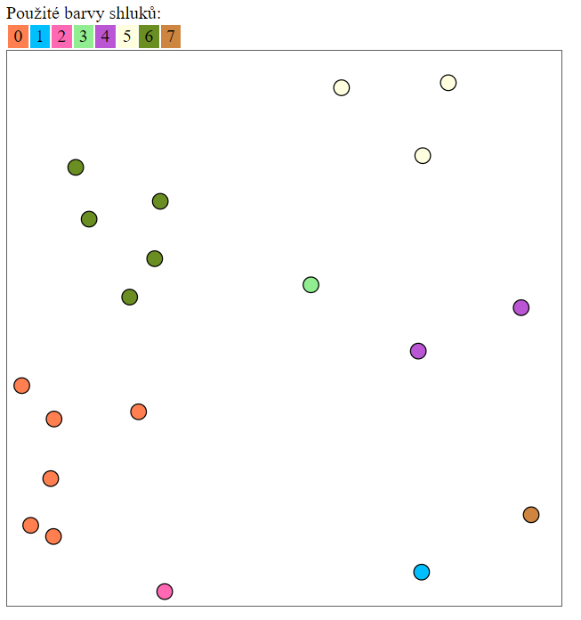

# Cluster Analysis - Single Linkage

This project implements a simple cluster analysis using the Single Linkage method. Cluster analysis, also known as cluster
classification, is a multidimensional statistical method used for grouping objects. It aims to classify units into clusters
in such a way that objects within the same cluster are more similar to each other than to objects from other clusters.

The cluster analysis in this project is performed on two-dimensional objects. Each object is identified by a unique integer.
The objects are stored in a text file.

<br>

----

<br>

## Usage

To compile and run the program, use the following command:

  ```
  gcc -std=c99 -Wall -Wextra -Werror -DNDEBUG cluster.c -o cluster -lm
  ```
  > **or use the makefile**
  ```
  make
  ```

To execute the program, run it in the following format:
  
  ```
  ./cluster FILE [N]
  ```

 - `FILE` is the name of the input file containing the data.
 - `N` is an optional argument defining the target number of clusters. (Default value: 1)

The output of the program is a list of clusters. Each cluster is represented by a line containing the cluster number and the number of objects in the cluster. The objects in the cluster are separated by a space. You can then paste the output into the [visualization tool](http://www.fit.vutbr.cz/study/courses/IZP/public/cluster.php) to see the result.

<br>

----

<br>


## Input File Format
The input data is stored in a text file in a LF format (unix) if you run it on unix OS, and CRLF if you run it on Windows. File must be in the same folder as the program. The first line of the file specifies the number of objects in the file in the following format:

```
count=N
```
Where N is the number of objects. Each subsequent line defines one object in the format:

```
OBJID X Y
```
Where `OBJID` is the unique identifier of the object, `X` is the X coordinate of the object, and `Y` is the Y coordinate of the object. The coordinates are real numbers. The values of `X` and `Y` should be within the range of 0 to 1000.

<br>

----

<br>

## Example 

<br>

>Assume we have file `objects.txt` with the following content:


```
count=20
40 86 663
43 747 938
47 285 973
49 548 422
52 741 541
56 44 854
57 795 59
61 267 375
62 85 874
66 125 211
68 80 770
72 277 272
74 222 444
75 28 603
79 926 463
83 603 68
86 238 650
87 149 304
89 749 190
93 944 835
```

> If we run the program with the following command:

```
./cluster objects.txt 8
```

> The output will be:

```
Clusters:
cluster 0: 40[86,663] 56[44,854] 62[85,874] 68[80,770] 75[28,603] 86[238,650]
cluster 1: 43[747,938]
cluster 2: 47[285,973]
cluster 3: 49[548,422]
cluster 4: 52[741,541] 79[926,463]
cluster 5: 57[795,59] 83[603,68] 89[749,190]
cluster 6: 61[267,375] 66[125,211] 72[277,272] 74[222,444] 87[149,304]
cluster 7: 93[944,835]
```

>And if you paste the output into the [visualization tool](http://www.fit.vutbr.cz/study/courses/IZP/public/cluster.php), you will get the following result:

<br>



*Visualized output*
